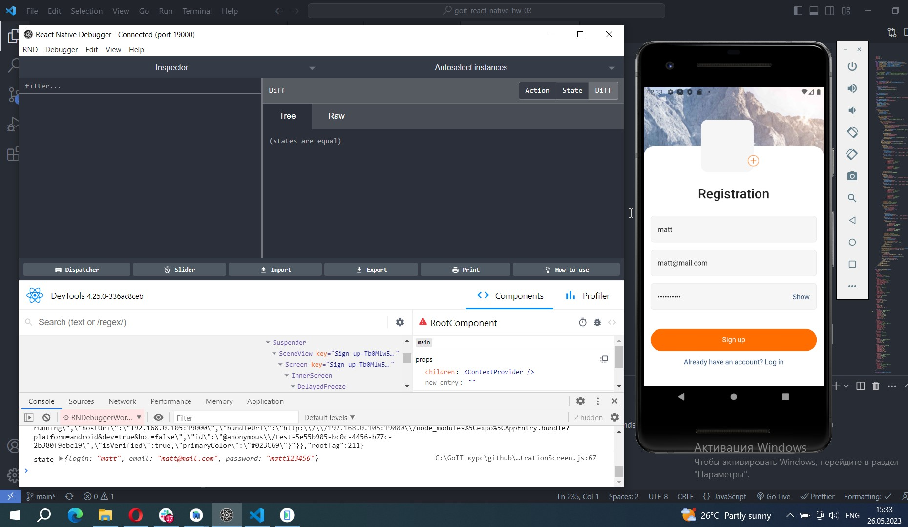
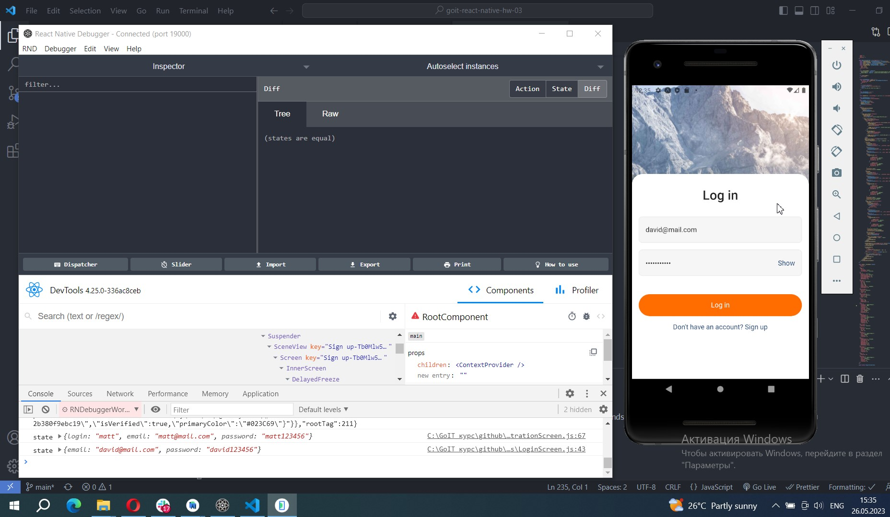

# Screenshots of project on Android emulator with React Native Debugger

## 1. Сhecking the launch of the remote debugger by logging data from the registration form

## 2. Сhecking the launch of the remote debugger by logging data from the login form

